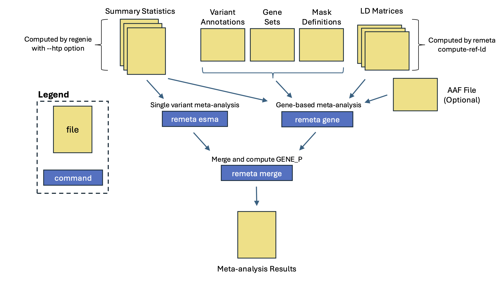

# Tutorial

Meta-analysis with **remeta** requires 3 steps:

1. Constructing per cohort reference LD matrices with **remeta**.
2. Computing single variant summary statistics in **regenie**.
3. Running meta-analysis in **remeta**.

In this example we generate summary statistics for 2 cohorts in **regenie**,
then meta-analyze them with **remeta**.
Example data was simulated with plink2 and is available in the `example` folder in the [**remeta** repository](https://github.com/rgcgithub/remeta).

For more details on installing and running **regenie** please visit the [**regenie** documentation](https://rgcgithub.github.io/regenie).


<p align="center" style="font-weight: bold;">
Main remeta workflow
</p>


## Construct reference LD matrices
**remeta** uses per cohort reference LD matrices for gene-based testing.
These matrices only need to be generated once and can be reused across traits.
**remeta** takes as input plink2 [pgen/pvar/psam](https://www.cog-genomics.org/plink/2.0/input#pgen) files.
It outputs a set of three files per chromosome: `$PREFIX.remeta.gene.ld`, `$PREFIX.remeta.buffer.ld` `$PREFIX.remeta.ld.idx.gz`.
The index file `$PREFIX.remeta.ld.idx.gz` is human readable and contains a list of all the variants in the LD matrix of each gene.

For marginal testing, only the LD between exome variants is required.
A plink2 dataset of exome variants is passed to **remeta** using the `--target-pfile $PLINK2_PREFIX` along with the `--skip-buffer` flag.
LD matrices for marginal testing are typically small and quick to compute.
In addition to exome variants, gene locations are specified in a `--gene-list` file that have four columns: `GENE_SET_NAME CHR GENE_START_POS GENE_END_POS`.
See [**File Formats**](file_formats.md) for more details along with an example file.

**remeta** can also perform gene-based tests conditional on variants in a buffer region around each gene.
Conditional analysis requires the LD between exome variants and the LD of variants in the buffer.
Imputed variants can be a good choice for conditional analysis.
Any variant in a gene or buffer region can be used for conditional analysis so long as it is stored in the LD matrix.

<p align="center" style="font-weight: bold;">
How remeta stores LD matrices for conditional analysis
</p>

<p align="center">

</p>

**remeta** has two options for computing the LD of exome variants and imputed variants depending on how they are stored in the input plink2 files.
If exome variants and imputed variants are in the same `pgen/pvar/psam` file,
then can be passed to remeta using the `--target-pfile` argument, and exome variants specified with the `--target-extract` argument.
If exome and imputed variants are stored in separate `pgen/pvar/psam` files,
then they can be passed to remeta using the `--target-pfile` and `--buffer-pfile` arguments.

Buffer regions can be specified in megabases or centimorgan using the `--buffer-mb` or `--buffer-cm` arguments respectively.
Note that `--buffer-cm` requires a genetic map.
See [**File Formats**](file_formats.md) for more details about the genetic map.

In the example below, we use simulated data for 500 samples and 2000 variants from 2 cohorts.
Genetic data was simulated using the `--dummy` flag in plink2.
The files `example.${cohort}.step2.{pgen, pvar, psam}` are the simulated genotypes.
A subset of simulated genotypes was chosen to represent exome variants, specified in the `example/example.${cohort}.step2.exome` variant list.
Here step 2 refers to the files used when running **regenie** step 2.

```bash
for cohort in cohort1 cohort2; do
  for chr in 1 2; do
    ./remeta compute-ref-ld \
      --target-pfile example/example.${cohort}.step2 \
      --target-extract example/example.${cohort}.step2.exome \
      --gene-list example/example.genelist \
      --chr ${chr} \
      --out example.${cohort}.chr${chr} \
      --threads `nproc` \
      --buffer-mb 1
  done
done
```


## Generate summary statistics
Association statistics are computed in **regenie** in a two step framework.
**regenie** step 1 fits a whole genome regression model on a subset of variants to account for relatedness, genetic ancestry, and polygenicity.
When preparing summary statistics for **remeta**, these will typically be a subset of common imputed variants.
**regenie** step 2 performs association testing across all variants using the output of step 1.
The output of step 2 is passed to **remeta** for meta-analysis.

### regenie step 1
For this example we simulated 500 samples and 1000 variants with plink2 to represent a subset of variants used in step 1.
These files are: `example/example.${cohort}.step1.{pgen,pvar,psam}`.
This step outputs the files `${cohort}.step1_1.loco` and `${cohort}.step1_pred.list` used by **regenie** step 2.
```bash
for cohort in cohort1 cohort2; do
  regenie \
    --step 1 \
    --pgen example/example.${cohort}.step1 \
    --phenoFile example/example.${cohort}.pheno.bt.tsv \
    --phenoCol Y \
    --bsize 100 \
    --bt --lowmem \
    --lowmem-prefix tmp_rg \
    --out ${cohort}.step1
done
```

### regenie step 2
In this step we use two sets of plink2 files, `example/example.${cohort}.step2.{pgen,pvar,psam}`, to perform association testing.
These are the same files used to generate the reference LD matrices.
Note that the `--htp $COHORT_NAME` options and `--minMAC 1` options should be used during step 2.
The first option outputs a summary statistics file in `htp` format.
This format has additional meta-data required by **remeta**.
The second option ensures all polymorphic variants are available for gene-based tests.
```bash
for cohort in cohort1 cohort2; do
  regenie \
    --step 2 \
    --pgen example/example.${cohort}.step2 \
    --phenoFile example/example.${cohort}.pheno.bt.tsv \
    --phenoCol Y \
    --bt \
    --firth --approx \
    --pred ${cohort}.step1_pred.list \
    --htp ${cohort} \
    --bsize 200 \
    --minMAC 1 \
    --out ${cohort}.step2
done
```

For good performance in **remeta** we recommended compressing and indexing the output HTP files with bgzip and tabix:
```bash
for cohort in cohort1 cohort2; do
  bgzip ${cohort}.step2_Y.regenie
  tabix -S1 -s2 -b3 -e3 ${cohort}.step2_Y.regenie.gz
done
```

## Meta-analysis with **remeta**


Meta-analysis with **remeta** has 3 steps:

1. Run single-variant meta-analysis.
2. Run gene-based meta-analysis across chromosomes.
3. Merge files and compute GENE_P.

### Run single-variant meta-analysis
**remeta** performs meta-analysis of single variants using effect size meta-analysis.
In this example, the two `htp` files generated by **regenie** as passed to the `--htp` argument,
and cohort names passed to the `--cohort` argument.
**remeta** outputs an `htp` file called `example.esma.remeta.gz`.
```bash
./remeta esma \
  --htp cohort1.step2_Y.regenie.gz cohort2.step2_Y.regenie.gz \
  --cohorts cohort1 cohort2 \
  --trait-name Y \
  --trait-type bt \
  --out example
```

### Run gene-based meta-analysis
Gene-based tests in **remeta** are defined using the same annotation files as **regenie**.
A `--set-list` file defines gene sets, an `--anno-file` defines variant annotations, and a `--mask-def` file defines groups of annotations in a mask.
See [File Formats](file_formats.md) for more information.

**remeta** provides a small utility to index bgzipped annotation files.
Indexing annotations can help improve performance for large-scale analyses.
This can be achieved in two commands.
```bash
bgzip example/example.annotations
./remeta index-anno --file example/example.annotations.gz
```

When running gene-based meta-analysis, exome variants should be specified using `--extract` argument to avoid including imputed variants in gene-based tests.
Alternatively, input `htp` files with the `SOURCE` info field can be used to identify variants to include in tests.
For example, if exome variants have the info field `SOURCE=EXOME`, then you can pass the `--sources EXOME` flag to **remeta** to extract them.

The output of this step are two files in `htp` format: `example.chr{1, 2}.gene.remeta.gz`.
```bash
for chr in 1 2; do
  ./remeta gene \
    --htp cohort1.step2_Y.regenie.gz cohort2.step2_Y.regenie.gz \
    --ld-prefix example.cohort1.chr${chr} example.cohort2.chr${chr} \
    --cohorts cohort1 cohort2 \
    --extract example/example.exome \
    --chr ${chr} \
    --set-list example/example.setlist \
    --anno-file example/example.annotations.gz \
    --mask-def example/example.masks \
    --trait-name Y \
    --trait-type bt \
    --burden-aaf-bins 0.9 0.99 \
    --acatv-max-aaf 0.99 \
    --skato-max-aaf 0.99 \
    --out example.chr${chr}
done
```

### Conditional analysis
Conditional analysis is performed with the `--condition-list` and `--condition-htp` arguments.
`--condition-list` takes a file with a list of variant IDs to condition on.
`--condition-htp` contains the summary statistics of the variants to be conditioned on,
which may be the same files passed to `--htp`.
Any variant in a gene or buffer region can be used for conditional analysis.
```bash
for chr in 1 2; do
  ./remeta gene \
    --htp cohort1.step2_Y.regenie.gz cohort2.step2_Y.regenie.gz \
    --condition-list example/example.condition_list \
    --condition-htp cohort1.step2_Y.regenie.gz cohort2.step2_Y.regenie.gz \
    --ld-prefix example.cohort1.chr${chr} example.cohort2.chr${chr} \
    --cohorts cohort1 cohort2 \
    --extract example/example.exome \
    --chr ${chr} \
    --set-list example/example.setlist \
    --anno-file example/example.annotations \
    --mask-def example/example.masks \
    --trait-name Y \
    --trait-type bt \
    --burden-aaf-bins 0.9 0.99 \
    --acatv-max-aaf 0.99 \
    --skato-max-aaf 0.99 \
    --out example.conditional.chr${chr}
done
```

### Merge and compute GENE_P
Per chromosome files and additional meta-analysis results can be merged together.
Additionally p-values per gene are computed by combining p-values across tests with ACAT.
```bash
./remeta merge \
  --htp example.chr1.gene.remeta.gz example.chr2.gene.remeta.gz example.esma.remeta.gz \
  --genep-def example/example.genepdef \
  --out example
```